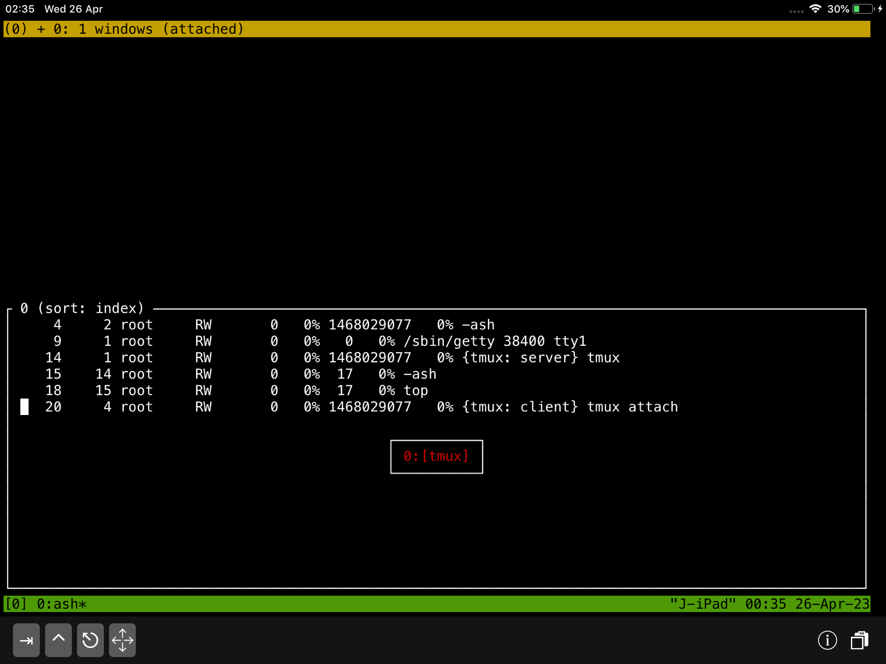

<div id="tmux-ipad"></div>

# My Notes About Tmux on iPad Using iSH.app

Tmux on iPad using iSH.app, allowing me to manage multiple terminal sessions and switch between my iPad, iPhone and desktop.


## Install tmux

```
j8-ipad:~# apk add tmux
j8-ipad:~# tmux -V
tmux 3.2
```

## What is Tmux?

`Tmux` is a server.

Try this:
```
j8-ipad:~# tmux ls
error connecting to /tmp/tmux-0/default (No such file or directory)
j8-ipad:~# 
```

When you run `tmux` it creates server in `/tmp/tmux-0/default`

`server > n num of session > n num of windows > n num of panes`

Inside server it creates session and inside session it creates a window and inside windows it creates panes.

1. start tmux session  
	```
	j8-ipad:~# tmux 
	```

2. list all active session  
	```
	j8-ipad:~# tmux ls 
	```
	```output
	0: 1 windows (created Tue Apr 25 23:57:52 2023) (attached)
	```
	I am attached to window 1 in session 0

3. Run top  
	```
	j8-ipad:/tmp# top
	```
4. Detache from the session

   `^b d`  (ctr-b d) detache    

	```output
	[detached (from session 0)]
	```
	I’m detachaed from session 0


5. List session 

	```
	j8-ipad:~# tmux ls
	0: 1 windows (created Wed Apr 26 00:24:59 2023)
	```
	Server is still running and session is on.


6. Attach to session  

	```
	j8-ipad:~# tmux a	
	```
	```output
	Mem: 889208K used, 130007K free, 130007K shrd, 0K buff, 0K cached
	CPU:  31% usr   0% sys   0% nic  68% idle   0% io   0% irq   0% sirq
	...
	```
	`top` is still runing


7. `^b s`  List all session

<!--  -->
<div style="text-align:center">

</div>


8. `^b $` Rename session

9. `^b c` Create another window


## Tmux configuration

> NOTE: Please note that a clean installation of iSH Alpine Linux does not include a `~/.tmux.conf` file by default. You will need to create this file yourself. However, if you install the `tmux-doc` package by running `apk add tmux-doc`, you will find an example `tmux.conf` file located at `/usr/share/doc/tmux/examples/tmux.conf`.  
To view the example configuration file from within `tmux`, you can use the `less` command, which allows you to scroll through the screen (as there is no scrolling in a tmux session by default). Simply type `less /usr/share/doc/tmux/examples/tmux.conf`. Alternatively, you can use the `bat` command if you have it installed, which provides a better user experience for viewing files.

`~/.tmux.conf`    default conf location

1. `tmux`  start

2. `^b d`  (ctr-b d) detache    

3. `tmux show -g`  print global configuration

4. `tmux show -g | sed 's/^/# set -g /' > ~/.tmux.conf`  

	To create a `~/.tmux.conf` file, first list all globals and pipe them using the `|` symbol to `sed`. In `sed`, replace the beginning of each line `^` with `# set -g`. Then, redirect the output of the `sed` command using `>` to the `~/.tmux.conf` file. This will comment out all the lines with a `#` hash symbol. You can keep these lines as a reference and make any necessary edits at the bottom of the `~/.tmux.conf file``.

5. `echo "set -g mouse on" >> ~/.tmux.conf && tmux kill-server && tmux`  
	
	This command appends "set -g mouse on" to the end of the `~/.tmux.conf` file and then kills any existing Tmux server processes and starts a new Tmux session with mouse support enabled.


>NOTE: On `ipad` **scrolling does NOT work** when dragging screen with finger.  
>But it does work in `copy-mode`.

6. Edit rest of the config in `vi` or `vim` (*I have better expirience with* `vi` *as far as screen refreshing*).  
  If you have problem with visibility. refresh screen by typing:  
  `^b r`    Redraw the current client`
  
7. `vi ~/.tmux.conf`

8. `G`    (shift-g) go to the end of the file,  

9. `o`    add empty line at the bottom (similar to `i`),

10. `set-option -sa terminal-overrides ",xterm*:Tc"`  
	
	Enable RGB color if running in xterm,  
    

11. `set -g default-terminal "tmux-256color"`  
	
	Change the default $TERM to tmux-256color,  
    

12. `esc` key, 

13. `:wq` `enter`


## Tmux Copy and Paset

1. add `set -g mode-keys vi` to ~/.tmux.conf

```
# enable vi mode for copy-mode and navigation (tmux defautl is emacs mode)
set -g mode-keys vi
```

2. `cat /etc/hosts`

3. start copy mode `^b [`

4. navigate to line
`127.0.0.1       localhost localhost.localdomain` with j,k,h,l

5. press `space bar` to start selecting

6. select text with arrow keys or (hjkl)

7. press `Enter` to copy,

8. open new doc `vi new.txt`

9. paste `^b ]`


`^b :` type: `list-keys`
`?`    (search up) *search for* **mode**
```
bind-key    -T prefix       [                    copy-mode
bind-key    -T prefix       ]                    paste-buffer -p
```

## Help `Ctrl-b ?`

```
C-b C-b     Send the prefix key                                                                  
C-b C-o     Rotate through the panes
C-b C-z     Suspend the current client
C-b Space   Select next layout
C-b !       Break pane to a new window
C-b "       Split window vertically
C-b #       List all paste buffers
C-b $       Rename current session
C-b %       Split window horizontally
C-b &       Kill current window
C-b '       Prompt for window index to select
C-b (       Switch to previous client
C-b )       Switch to next client
C-b ,       Rename current window
C-b -       Delete the most recent paste buffer
C-b .       Move the current window
C-b /       Describe key binding
C-b 0       Select window 0
C-b 1       Select window 1
C-b 2       Select window 2
C-b 3       Select window 3
C-b 4       Select window 4
C-b 5       Select window 5
C-b 6       Select window 6
C-b 7       Select window 7
C-b 8       Select window 8
C-b 9       Select window 9
C-b :       Prompt for a command
C-b ;       Move to the previously active pane
C-b =       Choose a paste buffer from a list
C-b ?       List key bindings
C-b C       Customize options
C-b D       Choose a client from a list
C-b E       Spread panes out evenly
C-b L       Switch to the last client
C-b M       Clear the marked pane
C-b [       Enter copy mode
C-b ]       Paste the most recent paste buffer
C-b c       Create a new window
C-b d       Detach the current client
C-b f       Search for a pane
C-b i       Display window information
C-b l       Select the previously current window
C-b m       Toggle the marked pane
C-b n       Select the next window
C-b o       Select the next pane
C-b p       Select the previous window
C-b q       Display pane numbers
C-b r       Redraw the current client
C-b s       Choose a session from a list
C-b t       Show a clock
C-b w       Choose a window from a list
C-b x       Kill the active pane
C-b z       Zoom the active pane
C-b {       Swap the active pane with the pane above
C-b }       Swap the active pane with the pane below
C-b ~       Show messages
C-b DC      Reset so the visible part of the window follows the cursor
C-b PPage   Enter copy mode and scroll up
C-b Up      Select the pane above the active pane
C-b Down    Select the pane below the active pane
C-b Left    Select the pane to the left of the active pane
C-b Right   Select the pane to the right of the active pane
C-b M-1     Set the even-horizontal layout
C-b M-2     Set the even-vertical layout
C-b M-3     Set the main-horizontal layout
C-b M-4     Set the main-vertical layout
C-b M-5     Select the tiled layout
C-b M-n     Select the next window with an alert
C-b M-o     Rotate through the panes in reverse     
C-b M-p     Select the previous window with an alert
C-b M-Up    Resize the pane up by 5            
C-b M-Down  Resize the pane down by 5                                                                   
C-b M-Left  Resize the pane left by 5    
C-b M-Right Resize the pane right by 5           
C-b C-Up    Resize the pane up                   
C-b C-Down  Resize the pane down                                                                        
C-b C-Left  Resize the pane left                                                                        
C-b C-Right Resize the pane right         
C-b S-Up    Move the visible part of the window up
C-b S-Down  Move the visible part of the window down
C-b S-Left  Move the visible part of the window left
C-b S-Right Move the visible part of the window right   

```


