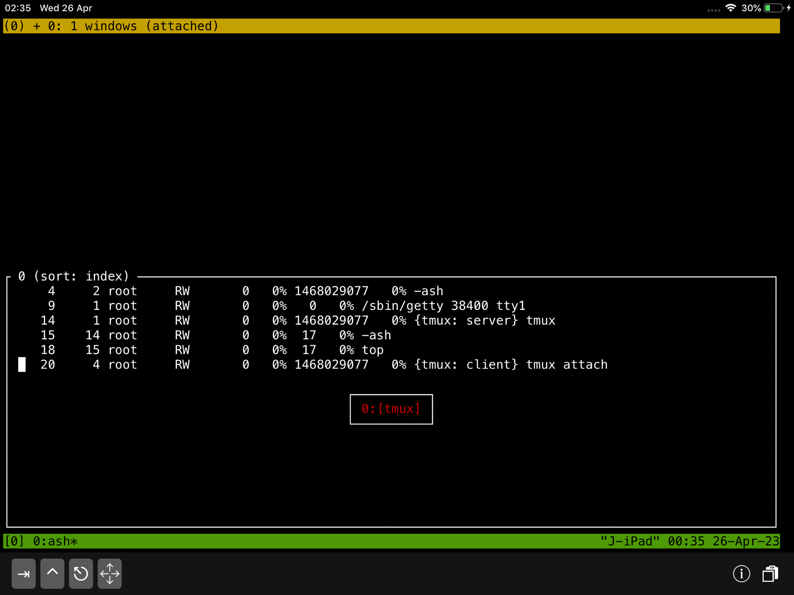

Tmux:  cheet shee, tmux conf,		

## Install tmux

```
J-iPad:~# apk add tmux
J-iPad:~# tmux -V
tmux 3.2
```

## What is Tmux?

`Tmux` is a server.

Try this:
```
J-iPad:~# tmux ls
error connecting to /tmp/tmux-0/default (No such file or directory)
J-iPad:~# 
```

When you run `tmux` it creates server in `/tmp/tmux-0/default`

`server > n num of session > n num of windows > n num of panes`

Inside serwer it creates session and inside session it creates a window and inside windows it creates panes.

1. start tmux session
```
J-iPad:~# tmux 
```

2. list all active session
```
J-iPad:~# tmux ls 
```
```output
0: 1 windows (created Tue Apr 25 23:57:52 2023) (attached)
```
I am attached to window 1 in session 0

3. Run top

iPad:/tmp# `top`

4. Detache from the session

type `^b d`

```output
J-iPad:~# tmux
[detached (from session 0)]
```
I’m detachaed from session 0

5. List session (looks similar like 1. but not (attached) at the end of line

```
J-iPad:~# tmux ls
0: 1 windows (created Wed Apr 26 00:24:59 2023)
J-iPad:~# 
```
Server is still running and session is on.


6. Attach to session
```
J-iPad:~# tmux attach
```
```output
Mem: 889208K used, 130007K free, 130007K shrd, 0K buff, 0K cached
CPU:  31% usr   0% sys   0% nic  68% idle   0% io   0% irq   0% sirq
Load average: 
  PID  PPID USER     STAT   VSZ %VSZ CPU %CPU COMMAND
    1     0 root     RW       0   0% 1468029077   0% /sbin/init
    2     1 root     RW       0   0%   0   0% /bin/login -f root
    4     2 root     RW       0   0% 1468029077   0% -ash
    9     1 root     RW       0   0%   0   0% /sbin/getty 38400 tty1
   14     1 root     RW       0   0% 1468029077   0% {tmux: server} tmux
   15    14 root     RW       0   0%  17   0% -ash

```
`top` is still runing


7. List all session from within a tmux 

type `^b s`  it will list all all session




pres `Enter`

8. `^ b $` Rename Session

9. `^ b c` Create another window


## Tmux configuration

> NOTE: On clean iSH Alpine Linux installation there is NO `~/.tmux.conf` by default. You need to create it. If you install `tmux-doc` package by typing `apk add tmux-doc` it will be example `tmux.conf` file located in: `/usr/share/doc/tmux/examples/tmux.conf`.
Take a look at example config file from within `tmux`, use `less` so you can scroll the screen *There is no scrolling in tmux session by default*.
`less /usr/share/doc/tmux/examples/tmux.conf` or even better use `bat` if you have one.

`~/.tmux.conf`  <— default conf location

1. `tmux`  start

2. `^b d`  (ctr-b d) detache    

3. `tmux show -g`  print global configuration

4. `tmux show -g | sed 's/^/# set -g /' > ~/.tmux.conf`
Create `~/.tmux.conf` by listing all globals and piping `|` it to `sed` where you substitute beginning of the line `^` with `# set -g` and then redirect `>` output to `~/.tmux.conf`. All lines will be commented with `#` hash. Keep it for reference and edit config at the bottom of this `~/.tmux.conf` file.

5. `echo "set -g mouse on" >> ~/.tmux.conf && tmux kill-server && tmux`  
Try to add mouse support at the bottom of this config file, restart tmux

>NOTE: On `ipad` **scrolling does NOT work** when dragging screen with finger.
>(*at least on my ipad*)

6. Edit rest of the config setting in `vi` or `vim` (*I have better expirience with* `vi` *as far as screen refreshing*.  
  If you have problem with visibility. refresh screen by typing:  
  `C-b r`       Redraw the current client`

6a. `vi ~/.tmux.conf`

6b. `shift g` <- go to the end of the file  

6c. `o` <- add empty line at the bottom (similar to `i`)

6d. Enable RGB colour if running in xterm(1)  
    `set-option -sa terminal-overrides ",xterm*:Tc"`

6e. Change the default $TERM to tmux-256color  
    `set -g default-terminal "tmux-256color"`

6f. `esc` key 

6g. `:wq` `enter`


## Help `Ctrl-b ?`

```
C-b C-b     Send the prefix key                                                                  
C-b C-o     Rotate through the panes
C-b C-z     Suspend the current client
C-b Space   Select next layout
C-b !       Break pane to a new window
C-b "       Split window vertically
C-b #       List all paste buffers
C-b $       Rename current session
C-b %       Split window horizontally
C-b &       Kill current window
C-b '       Prompt for window index to select
C-b (       Switch to previous client
C-b )       Switch to next client
C-b ,       Rename current window
C-b -       Delete the most recent paste buffer
C-b .       Move the current window
C-b /       Describe key binding
C-b 0       Select window 0
C-b 1       Select window 1
C-b 2       Select window 2
C-b 3       Select window 3
C-b 4       Select window 4
C-b 5       Select window 5
C-b 6       Select window 6
C-b 7       Select window 7
C-b 8       Select window 8
C-b 9       Select window 9
C-b :       Prompt for a command
C-b ;       Move to the previously active pane
C-b =       Choose a paste buffer from a list
C-b ?       List key bindings
C-b C       Customize options
C-b D       Choose a client from a list
C-b E       Spread panes out evenly
C-b L       Switch to the last client
C-b M       Clear the marked pane
C-b [       Enter copy mode
C-b ]       Paste the most recent paste buffer
C-b c       Create a new window
C-b d       Detach the current client
C-b f       Search for a pane
C-b i       Display window information
C-b l       Select the previously current window
C-b m       Toggle the marked pane
C-b n       Select the next window
C-b o       Select the next pane
C-b p       Select the previous window
C-b q       Display pane numbers
C-b r       Redraw the current client
C-b s       Choose a session from a list
C-b t       Show a clock
C-b w       Choose a window from a list
C-b x       Kill the active pane
C-b z       Zoom the active pane
C-b {       Swap the active pane with the pane above
C-b }       Swap the active pane with the pane below
C-b ~       Show messages
C-b DC      Reset so the visible part of the window follows the cursor
C-b PPage   Enter copy mode and scroll up
C-b Up      Select the pane above the active pane
C-b Down    Select the pane below the active pane
C-b Left    Select the pane to the left of the active pane
C-b Right   Select the pane to the right of the active pane
C-b M-1     Set the even-horizontal layout
C-b M-2     Set the even-vertical layout
C-b M-3     Set the main-horizontal layout
C-b M-4     Set the main-vertical layout
C-b M-5     Select the tiled layout
C-b M-n     Select the next window with an alert
C-b M-o     Rotate through the panes in reverse     
C-b M-p     Select the previous window with an alert
C-b M-Up    Resize the pane up by 5            
C-b M-Down  Resize the pane down by 5                                                                   
C-b M-Left  Resize the pane left by 5    
C-b M-Right Resize the pane right by 5           
C-b C-Up    Resize the pane up                   
C-b C-Down  Resize the pane down                                                                        
C-b C-Left  Resize the pane left                                                                        
C-b C-Right Resize the pane right         
C-b S-Up    Move the visible part of the window up
C-b S-Down  Move the visible part of the window down
C-b S-Left  Move the visible part of the window left
C-b S-Right Move the visible part of the window right   
```

